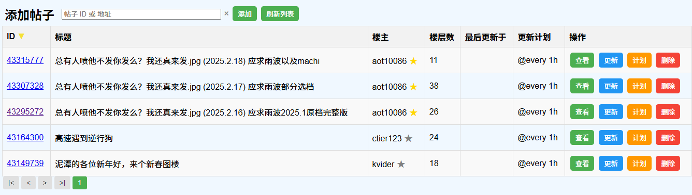

# ngamm
为 [ngapost2md](https://github.com/ludoux/ngapost2md) 提供的一个简单的管理工具

可以执行 [Cron](https://godoc.org/github.com/robfig/cron) 任务

## 主要功能
### 已实现
- [x] 下载指定帖子, 包括帖子内多媒体资源
- [x] 管理帖子
- [x] 定时更新帖子
- [x] 预览帖子内容
- [x] 订阅帖子作者的新帖子, 可以附加过滤条件
- [x] 自动保存帖子中的分享资源, 现在支持 **百度网盘** 和 **夸克网盘**
- [x] 网盘各种失败信息发送到 `webhook`
- [x] 帖子无图模式预览 (防止在不合适的场合蹦出来大兔子)
### 未来实现
- [ ] 在管理页面显示帖子是否包含网盘资源
- [ ] 夸克网盘支持添加解压密码

## 部署方式
### docker 方式(推荐)

自动构建 NGAMM 并且整合 ngapost2md

你只需要提供正确的 [`config.ini`](https://github.com/ludoux/ngapost2md) 放到映射的 `data` 目录下

第一次启动容器后, 会在 `data` 目录下自动释放 `ngapost2md` 并生成 `config.ini`

必须配置项:
* `base_url`: 你访问 NGA 的地址, 如我这边就是 https://ngabbs.com
* `ua`: 你的浏览器的 `UserAgent`, 可以按 `F12`, 在控制台里输入 `navigator.userAgent` 就会输出
* `ngaPassportUid`: `F12` -> 应用程序 -> Cookie -> https://ngabbs.com
找到同名的字段, 点击, 在下面的 Cookie Value 中全选, 复制粘贴
* `ngaPassportCid`: 步骤同上

#### docker

```shell
docker pull i2534/ngamm:latest
docker run -it -p 5842:5842 -v ./data:/app/data -e TOKEN="" i2534/ngamm:latest
```

#### docker compose
```yaml
services:
  ngamm:
    image: i2534/ngamm:latest
    container_name: ngamm
    ports:
      - "5842:5842"
    volumes:
      - ./data:/app/data
    environment:
      # 内网使用可以留空, 开放到外网, 最好设置一个复杂点的, 否则容易被攻击
      - TOKEN=
    restart: unless-stopped
```

#### docker with 网盘
为了自动保存好心人分享的资源, 现在逐步支持帖子内的网盘分享链接自动转存到网盘内

部署时, 将镜像更改为 `i2534/ngamm-pan:latest` 既可, 如: 
```shell
docker run -it -p 5842:5842 -v ./data:/app/data -e TOKEN="" i2534/ngamm-pan:latest
```

只支持 百度网盘 和 夸克网盘, 需要在 `/app/data/pan` 下配置 [`config.ini`](./assets/pan-config.ini)

第一次启动会自动生成 `config.ini`, 配置 `webhook` 后, 转存失败后会自动发送消息

百度网盘 使用 [BaiduPCS-Go](https://github.com/qjfoidnh/BaiduPCS-Go) 实现

夸克网盘 使用 [quark-auto-save](https://github.com/Cp0204/quark-auto-save/blob/main/quark_auto_save.py) 代码转译

如果一切正常, 将会自动分析帖子前 *4* 楼内的内容, 遇到 `pan.baidu.com` 或 `pan.quark.cn` 类型的链接会视为分享链接, 其后跟随的 `提取码` 后的 **4** 位字符视为 `提取码`, 然后转存此分享到 `/我的资源/帖子ID` 或 `来自：分享/帖子ID` 下

另外会尝试寻找 `解压密码`, 如果发现解压密码, 则将密码保存到 `帖子ID/_uzp.txt` 中 (仅限百度网盘, 夸克网盘正在研究中)

### 单独程序方式(不推荐)
#### 准备 ngapost2md

先去 [ngapost2md](https://github.com/ludoux/ngapost2md) 下载最新的版本, 然后根据 [配置说明](https://github.com/ludoux/ngapost2md) 配置好, 确保单独使用 
```
./ngapost2md {id}
```
将 `{id}` 替换成实际的帖子ID, 可以正确下载到帖子

将配置好的 `ngapost2md` 程序 和 其同目录下的所有内容都放置到 `ngap2m` 文件夹里

#### 下载 ngamm

进入 [Actions](https://github.com/i2534/ngamm/actions/workflows/build.yml)
进入最后已成成功构建的 workflow , 在 `Artifacts` 中找到需要的程序下载解压

#### 配置 ngamm

将程序解压放到 `ngap2m` 文件夹同目录下, 执行
```
chmod +x ngamm
```
给与程序可执行权限

```
./ngamm -p 5842 -m ngap2m/ngapost2md
```
启动 `ngamm`, 看到 `Server started, listening on :5842` 表示启动成功

## 使用

### 使用页面管理

浏览器访问 `url:port`

`port` 默认为 `5842`

## UI 和 功能
Home 页面:

View 页面:
